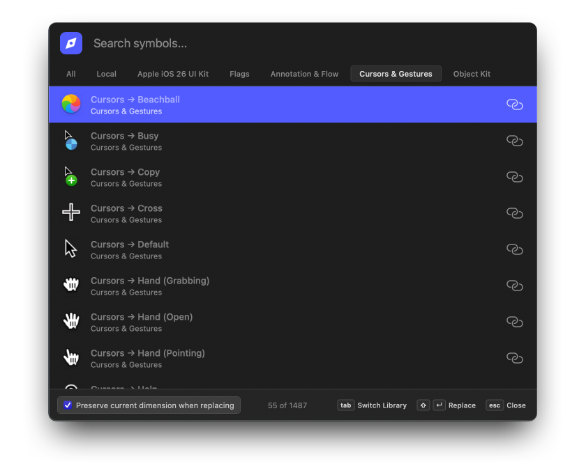

# 🧭 Component Browser

A fast, keyboard-driven Sketch plugin for browsing and inserting Symbols (Components) from your document and libraries.

## Features

- 🔍 **Smart Search** — Instantly filter symbols by name
- 🎨 **Source Filtering** — Switch between All, Local, and Library sources
- *(coming soon)* 🖼️ **Preview Thumbnails** — Visual previews for library symbols 
- ⌨️ **Keyboard First** — Navigate and insert without touching the mouse
- 🔄 **Batch Replace** — Replace multiple selected layers at once

## Installation

1. Download the latest release: [Component Browser.sketchplugin](https://github.com/funk4d/Component-Browser-Sketch-Plugin/releases/latest)
2. Double-click to install in Sketch

## Usage

### Open Component Browser

**`Cmd + Shift + ;`** — Launch the browser from anywhere in Sketch

### Navigation

| Key | Action |
|-----|--------|
| `↑` / `↓` | Navigate through symbols |
| `Tab` | Next source filter (All → Local → Library) |
| `Shift + Tab` | Previous source filter |
| `Enter` | Insert selected symbol at viewport center |
| `Shift + Enter` | **Replace** selected layer(s) with symbol |
| `Esc` | Close browser |

### Source Filters

- **All** — Show all symbols (local + libraries)
- **Local** — Symbols defined in current document only
- **Library Name** — Symbols from specific library

### Replace Mode

When you have layers selected, press **`Shift + Enter`** to replace them with the chosen symbol:
- Preserves position
- Preserves dimensions (with checkbox option)
- Works with multiple selections — replaces all selected layers at once

## Tips

- **Search as you type** — Start typing to filter symbols instantly
- **Quick library switch** — Use `Tab` to cycle through sources without leaving the keyboard
- **Drag to move** — Grab the search bar to reposition the window

## Roadmap

- [ ] Add symbol preview thumbnails
- [ ] Add customization (settings/preferences)
- [ ] Integrate search for free icon libraries (e.g., Remix Icon)
- [ ] Add more commands

## Credits

Created by [Dmytro Shevchuk](https://github.com/funk4d)

## License

MIT
